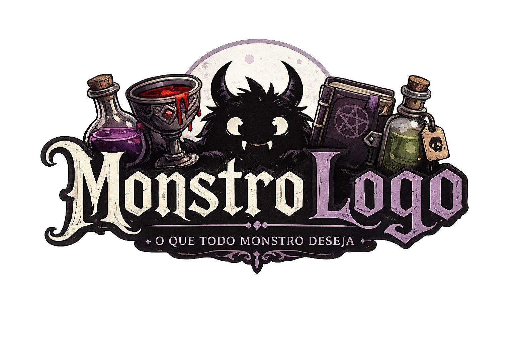

<h1 align="center" style="font-weight: bold;">Monstrologo 🧟</h1>

<p align="center">
 <a href="#descricao">Descrição</a> • 
 <a href="#linguagens">Linguagens</a> • 
 <a href="#primeiros_passos">Primeiros Passos</a> • 
  <a href="#equipe">Colaboradores</a> •
 <a href="#contribuir">Contribuir</a>
</p>

<p align="center">
    <b>O site Monstrologo é um CRUD feito para monstros de diferente mitos e lendas poderem registrar seus itens preferidos.</b>
</p>

<hr>

<p align="center">
    
</p>

<h2 id="descricao">📝 Descrição</h2>

<p> 
O Monstrologo foi pensado para ser um sistema CRUD no qual diferentes tipos de monstros podem registrar, pesquisar, ver e deletar seus itens preferidos.
</p>

<p>
Os itens podem ser diversos. Uma taça de vinho para um vampiro, por exemplo, ou até mesmo uma poção para uma bruxa. Os itens são da escolha do usuário.
</p>

<h3>
Para salvar o item no bestiário, o monstro deve digitar as seguintes característiscas do item: 
</h3>

- Nome
- Cor
- Custo
- Tipo de Monstro
- Raridade do Item
- Origem

<h2 id="linguagens">💻 Linguagens</h2>

- JavaScript
- CSS
- HTML

<h2 id="primeiros_passos">🚀 Primeiros Passos</h2>

<h3>Pré-requisitos</h3>

Pré-requisitos para rodar o projeto corretamente:

- [Git](https://git-scm.com)

<h3>Clonando</h3>

Como clonar o projeto.

```bash
git clone "https://github.com/mrgh0st9158/Senai-1-Fase.git"
```

<h2 id="equipe">Equipe</h2>

Abaixo segue a lista da equipe do projeto:

<table>
  <tr>
    <td align="center">
      <a href="https://github.com/mrgh0st9158">
        <br>
        <sub>
          <b>Athos Cristian</b>
        </sub>
      </a>
    </td>

  </tr>
</table>

<h2 id="contribuir">📫 Contribuir</h2>

Aqui irei explicar como outros devs poderão contribuir para o projeto.

1. `git clone "https://github.com/mrgh0st9158/Senai-1-Fase.git"`
2. `git config user.email "email-aqui"`
3. `git config user.name "usuario-aqui"`
4. Siga os padrões de commit
5. Abra um Pull Request explicando o problema resolvido ou mudança feita, se existir, anexar uma captura de tela das mudanças, depois espere pela revisão!

<h3>Documentação que pode ajudar</h3>

[📝 Como criar um Pull Request](https://www.atlassian.com/br/git/tutorials/making-a-pull-request)

[💾 Padrões de commit](https://gist.github.com/joshbuchea/6f47e86d2510bce28f8e7f42ae84c716)